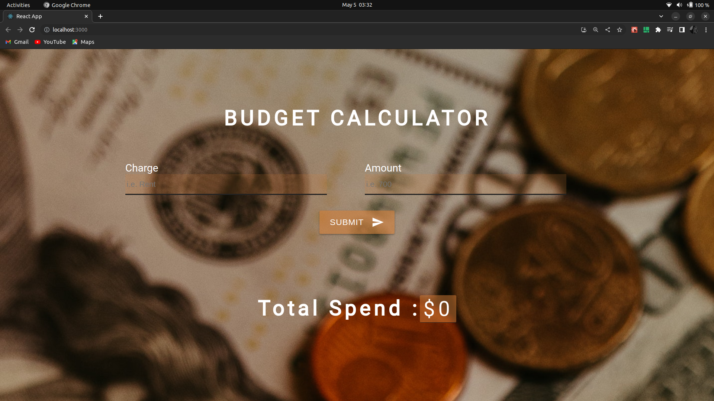

# BudgetCalculator-project

A budget calculator that allows a user to measure their monthly expenses 

This is a simple application that allows the user to enter their expected monthly expenses i.e rent, car bills, etc as well as the amount it costs for said item the user will input

After all inputs are made, this calculator will then add up all the item cost listed and will the show the user their final estimated monthly spend.

# Set up and functionality

- In this application, I will create a list and for every item on the list it will render the expense item.

- The application will also save your entered items in the local storage (which means your item inputs will not disappear once you refresh your page)

- This application will also allow the user to submit an item, edit it if need be and even delete if item isn't in use. The user can also clear all their items if they wish to make new entries

- I then used the UUID("universally unique identifier"), which give an item a unique ID and to correctly help find a record so it can be updated, deleted, and so on.

# images 

 
